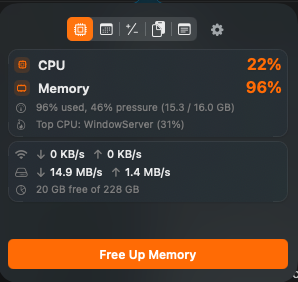
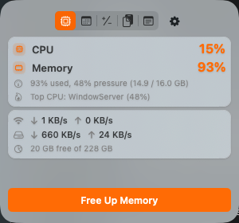
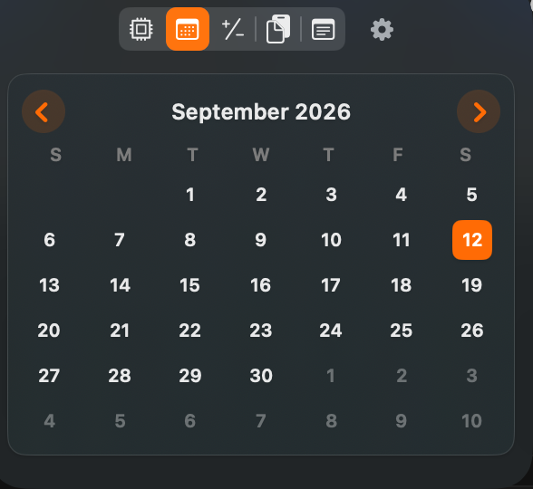
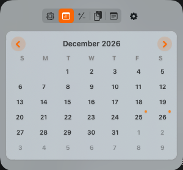
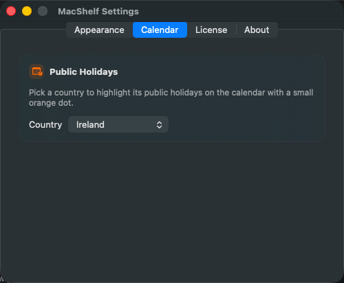
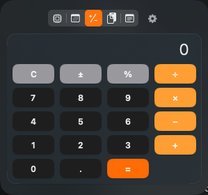
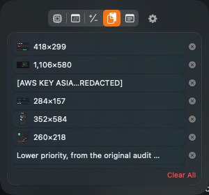
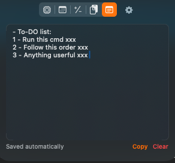

# MacShelf

A single macOS menu-bar app combining live system monitoring, quick widgets,
clipboard history with a global paste picker, and a scratch notepad. Swift/AppKit
+ SwiftUI, no third-party dependencies.

Design refreshed to match the shared MacGroom-level design system used across
the mac-apps line (semantic colors, a scalable `.appFont` typography helper,
an Appearance/Text Size settings pane) — see
`gogenops/apps/landing/mac-apps/DESIGN-SYSTEM.md`.

**v2 visual refresh:** the popover and Settings now use the design system's
"modern & colorful" v2 pass — an orange `Color.appAccent` identity color,
tinted rounded-square icon tiles instead of bare SF Symbols, vibrancy
materials and card layouts throughout, a bolder stat-number type hierarchy,
spring animations on tab/section switches, and a light-mode audit fix so the
popover's own vibrancy chrome (not just its SwiftUI content) actually follows
Settings' Appearance picker instead of always tracking the system appearance.

## Screenshots

| Stats — dark | Stats — light |
|---|---|
|  |  |

| Calendar — dark | Calendar — light, holidays marked |
|---|---|
|  |  |

Public holidays are computed for whichever country you pick in Settings → Calendar, not hand-maintained:



| Calculator | Clipboard (Pro) | Notepad (Pro) |
|---|---|---|
|  |  |  |

Supersedes three predecessor apps (each left intact, still independently buildable):

- [sysmonitor-menubar](https://github.com/soodrajesh/sysmonitor-menubar) — CPU/MEM readout, Free Up Memory
- `quick-tools` in [mac-widgets](https://github.com/soodrajesh/mac-widgets) — Calculator/Calendar popover
- [mac-clipboard](https://github.com/soodrajesh/mac-clipboard) / ClipKeep — clipboard history, ⌘⇧V picker

## Features

### Menu bar

- Live two-line **CPU %** / **MEM %** readout; values turn **red** under load
- **Left-click** → popover (five tabs, fixed size so switching tabs does not resize the panel)
- **Right-click** → Free Up Memory, Enable Accessibility (if needed), Settings…, Quit
- No Dock icon (`LSUIElement`); installs to `/Applications`, ad-hoc signed so Accessibility survives rebuilds
- **Settings…** → Appearance (System/Light/Dark), Calendar, License, Updates, About

### Popover tabs

| Tab | What it does | Tier |
|-----|----------------|------|
| **Stats** | CPU/memory detail, top CPU process, network and disk throughput, disk free/total, **Free Up Memory** | Free |
| **Calendar** | Month grid; Irish public holidays (computed) | Free |
| **Calculator** | Basic four-operation calculator | Free |
| **Clipboard** | Recent copies (image thumbnails); click to copy and auto-paste into the app you had focused | Pro |
| **Notepad** | Scratch pad with debounced auto-save; **Copy** and **Clear** (with confirm) buttons | Pro |

A gated tab shows an "Unlock Pro" prompt instead of silently disabling itself.

### Global hotkeys

| Shortcut | Action | Tier |
|----------|--------|------|
| **⌘⇧V** | Floating searchable paste-picker (↑/↓, Return to paste) — works from any app | Pro |
| **⌘⇧N** | Open the popover on the **Notepad** tab (or switch to it if the popover is already open) | Pro |

Both hotkeys stay registered when unlicensed; firing either one opens
Settings instead of the picker/notepad (no auto-jump to the License tab).

## MacShelf Pro

Stats, Calendar, and Calculator are free forever. **Clipboard history**, the
**Notepad**, and the **⌘⇧V** / **⌘⇧N** global hotkeys are MacShelf Pro
features, unlocked with a license key entered in **Settings → License**
(right-click the menu bar icon → Settings…).

Licensing is per-app — this is a separate product/license from MacGroom's,
verified against [Polar.sh](https://polar.sh)'s customer-portal License Keys
API, the same backend MacGroom (mac-cleanup) uses, structurally ported from
`mac-cleanup/Sources/MacGroomLicenseCheck.swift`:

- License key stored under `@AppStorage`/`UserDefaults` key
  `com.rajeshsood.macshelf.licenseKey`; the verified license itself is
  cached in the Keychain with an HMAC tag so a hand-forged cache entry is
  rejected and forces a real network re-check.
- `Sources/MacShelfLicenseCheck.swift` — the `LicenseChecker`/`License`
  types and the Polar API call.
- `Sources/LicenseState.swift` — the app-wide `ObservableObject` source of
  truth for `isProLicensed`, shared by the popover and the Settings window.
- `Sources/LicenseManagementView.swift` — the license entry/status UI.
- `Sources/UnlockProView.swift` — the in-tab upsell shown when a gated
  feature isn't licensed.

**Live** — `PolarConfig` in `MacShelfLicenseCheck.swift` points at the real
MacShelf Pro product/benefit in Polar. A license key activates on up to 3
Macs (`Limit Activations` on the Polar benefit); users can free up a slot
themselves via Polar's customer portal if they retire a Mac.

### Notepad editing

Click inside the text area so it has focus, then use standard shortcuts:

| Shortcut | Action |
|----------|--------|
| **⌘A** | Select all |
| **⌘C** | Copy |
| **⌘X** | Cut |
| **⌘V** | Paste |
| **⌘Z** / **⌘⇧Z** | Undo / redo |

MacShelf installs a hidden **Edit** menu so these work in a menu-bar-only app.

**Data file:** `~/Library/Application Support/MacShelf/notepad.txt`

## Build

Requires the Xcode Command Line Tools (`xcode-select --install`).

```bash
./build.sh
```

Compiles `Sources/*.swift`, renders the app icon, ad-hoc signs, and installs to `/Applications/MacShelf.app`.

## Before first launch

Quit predecessor apps to avoid duplicate clipboard polling and a **⌘⇧V** conflict:

```bash
pkill -f SysMonitor; pkill -f QuickTools; pkill -f ClipKeep
open /Applications/MacShelf.app
```

## Enable auto-paste (optional)

Clipboard auto-paste needs **Accessibility**. MacShelf uses a new bundle ID — a
grant to ClipKeep does **not** carry over.

**System Settings → Privacy & Security → Accessibility → enable MacShelf**

Without it, picking from history still copies to the clipboard; you paste with **⌘V** in the target app yourself.

## Free Up Memory

`purge` requires root. **Free Up Memory** uses the system administrator sheet
(**Touch ID** where available, otherwise your password). That works on managed
Macs where custom `/etc/sudoers.d` files are blocked.

### Skip the prompt (optional)

If you can edit sudoers, a narrow **NOPASSWD** rule for `/usr/sbin/purge` only
lets MacShelf run silently (it tries `sudo -n` first):

```bash
echo "$(whoami) ALL=(root) NOPASSWD: /usr/sbin/purge" | \
  sudo tee /etc/sudoers.d/macshelf-purge >/dev/null
sudo chmod 440 /etc/sudoers.d/macshelf-purge
sudo visudo -c
```

## Data on disk

| Path | Purpose |
|------|---------|
| `~/Library/Application Support/MacShelf/notepad.txt` | Notepad text |
| `~/Library/Application Support/ClipKeep/` | Clipboard history (JSON + image PNGs; shared layout with ClipKeep) |

## Auto-start at login

**System Settings → General → Login Items & Extensions → +** → `MacShelf.app`

## License

MIT
